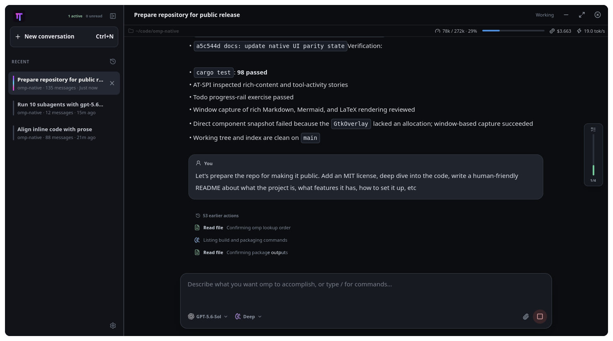
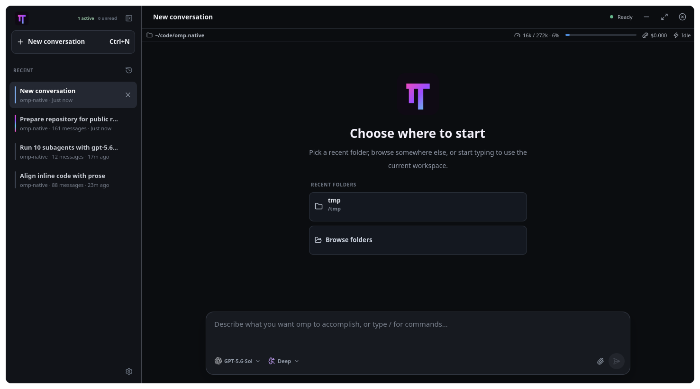

# omp-gtk

A native GTK desktop frontend for `omp`.

`omp-gtk` keeps the agent runtime in `omp` and gives it a Linux desktop interface: streaming conversations, concurrent sessions, rich tool output, image prompts, model controls, todo progress, subagent activity, notifications, and session management.

This repository contains only the frontend. It does not replace or bundle `omp`; an installed `omp` executable with `rpc-ui` support is required.

## Status

`omp-gtk` is pre-release software. Linux with GTK is the primary target, and the packaging setup currently covers Ubuntu 26.04, Fedora 44, and Arch Linux. Other platforms are not packaged and may need platform-specific work.

The application requires GTK 4.22 or newer and libadwaita 1.9 or newer.

## Screenshots



*An active conversation with session status, grouped activity, and runtime telemetry.*



*Starting a new conversation from a recent or selected workspace.*

## Highlights

### A desktop conversation workspace

- Stream assistant text, thinking, tool calls, tool results, usage, cost, and context information.
- Render streaming-safe GitHub-flavored Markdown, syntax-preserving code blocks, tables, task lists, links, inline and display LaTeX, and Mermaid diagrams as responses arrive.
- Separate heading sections visually and expose a hoverable outline for the heading-rich message currently in view.
- Keep tool activity compact by grouping related thinking and tool calls without hiding errors or results.
- Display images returned by tools.

### A capable composer

- Write multiline prompts and use keyboard-driven slash-command completion.
- Attach multiple PNG or JPEG images from disk or the clipboard, preview them in submission order, remove them individually, and retain them when submission fails.
- Send a normal prompt while idle, steer an active turn, queue a follow-up, or stop the current turn explicitly.
- See authoritative queued-message counts from `omp`.
- Choose the active model and reasoning level without leaving the conversation.

### Sessions and workspaces

- Run several `omp` sessions concurrently and switch between warm conversation views without losing scroll position.
- See running and unread state in the session sidebar.
- Start a conversation in a selected workspace and reopen persisted sessions from history.
- Rename, reveal, close, delete, and reorder sessions.
- Branch from a selected message or hand work off into a fresh session.
- View agent-managed todo progress in a compact, read-only rail.

### Agents, alerts, and desktop integration

- Follow subagent lifecycle and progress in the Agent Hub.
- Open a subagent transcript while it continues to update.
- Receive desktop notifications and configurable sounds for prompts, completions, errors, and agent activity.
- Install and select sound packs from the settings UI.
- Use a standard desktop launcher, application icon, and single-instance GTK application.

## How it works

`omp-gtk` starts `omp --mode rpc-ui` as a child process in the selected workspace. Requests are written to the child's standard input; state snapshots and streaming events are read from standard output. Session, queue, model, todo, branch, and agent state remain authoritative in `omp`.

The child process starts through the user's login shell, so normal shell environment configuration is available. The frontend resolves the executable in this order:

1. `OMP_BIN`, when set;
2. an executable named `omp` on `PATH`;
3. `~/.local/bin/omp`;
4. the shell's normal `omp` lookup as a final fallback.

Model providers, credentials, tools, extensions, and session storage are configured through `omp`, not duplicated in this frontend.

## Requirements

- Linux or macOS
- GTK 4.22+
- libadwaita 1.9+
- Fontconfig, plus ALSA development libraries on Linux
- A C toolchain and `pkg-config`
- A current stable Rust toolchain with Rust 2024 edition support
- An installed `omp` with `--mode rpc-ui` support

If a distribution's Rust package is too old, install the current stable toolchain with [rustup](https://rustup.rs/).

## Build from source

### 1. Install system dependencies

Ubuntu 26.04:

```bash
sudo apt install \
  build-essential pkg-config \
  libasound2-dev libfontconfig1-dev \
  libgtk-4-dev libadwaita-1-dev
```

Fedora 44:

```bash
sudo dnf install \
  gcc pkgconf-pkg-config \
  alsa-lib-devel fontconfig-devel \
  gtk4-devel libadwaita-devel
```

Arch Linux:

```bash
sudo pacman -S --needed \
  base-devel pkgconf alsa-lib fontconfig gtk4 libadwaita rust
```

macOS with [Homebrew](https://brew.sh/):

```bash
xcode-select --install
brew install fontconfig gsettings-desktop-schemas gtk4 libadwaita pkgconf
```

Install Rust separately if it is not already available:

```bash
rustup toolchain install stable
rustup default stable
```

### 2. Build

From this repository checkout:

```bash
cargo build --locked
```

### 3. Run

Make sure `omp` is installed and discoverable, then run:

```bash
cargo run --locked
```

To use a specific executable:

```bash
OMP_BIN=/path/to/omp cargo run --locked
```

The compiled development binary is also available at `target/debug/omp-gtk`.

## Build Linux packages

The packaging scripts build isolated native packages for Ubuntu, Fedora, and Arch Linux. Docker or Podman is required.

```bash
./packaging/build-packages.sh all
```

Build one target when iterating:

```bash
./packaging/build-packages.sh ubuntu
./packaging/build-packages.sh fedora
./packaging/build-packages.sh arch
```

Artifacts are written to `dist/`. Set `CONTAINER_RUNTIME=docker` or `CONTAINER_RUNTIME=podman` to select a runtime explicitly. Cargo downloads and target artifacts are cached under `~/.cache/omp-gtk/packaging` by default.

For a locally built Debian package, use the included installer so apt handles dependencies and sandboxing correctly:

```bash
./packaging/install-deb.sh dist/omp-gtk_*.deb
```

## Development

Run the Rust test suite:

```bash
cargo test --locked
```

### Component gallery

The component gallery renders production GTK widgets with deterministic fixture data and does not start `omp`:

```bash
cargo build --locked --features ui-stories --bin ui-gallery
target/debug/ui-gallery --list
target/debug/ui-gallery --story conversation/rich-content-stress
```

Headless AT-SPI inspection and interaction are available through the Python wrapper:

```bash
/usr/bin/python3 tools/ui_story.py inspect tool-group/running
/usr/bin/python3 tools/ui_story.py exercise todos/active --steps \
  '[{"action":"expect","role":"label","contains":"active"}]'
```

Headless automation requires Python AT-SPI bindings, KWin's virtual Wayland compositor, Spectacle, Pillow, and D-Bus. See [`docs/ui-automation.md`](docs/ui-automation.md) for installation, interaction, and screenshot instructions.

## Architecture

The codebase intentionally keeps the frontend boundary narrow:

- `src/bridge/` owns child-process startup, request serialization, streaming event decoding, and bounded chunk reassembly.
- `src/app.rs` is the application controller. It reconciles authoritative `omp` state with GTK views, manages concurrent runtimes, and routes user actions.
- `src/ui/` contains the workspace, conversation renderer, composer, sidebar, todo rail, Agent Hub, settings, dialogs, styles, and component stories.
- `src/session_catalog.rs` discovers session transcripts and reconstructs the active persisted branch for fast history display.
- `src/agent_hub.rs` reduces subagent lifecycle events into the runtime roster and tree shown by the UI.
- `src/alerts.rs` and `src/sound_registry.rs` own notification preferences, audio playback, and sound-pack discovery.
- `packaging/` contains reproducible containerized builders for Debian, RPM, and Arch packages.

GTK remains on the main thread. Bridge I/O and expensive image work are moved off it, then reconciled back into the UI through event channels. `omp-gtk` does not attempt to reimplement agent orchestration or mutate protocol-owned state optimistically.

## Current limitations

- Linux is the only packaged and regularly exercised desktop target.
- `omp` modes that are not exposed through `rpc-ui`, including `/vibe`, `/goal`, `/guided-goal`, and `/loop`, are intentionally unavailable rather than sent as ordinary prompts.
- Some interactive-terminal features require additional transport-neutral `omp` APIs before they can be represented safely in the native UI.
- The Agent Hub currently focuses on runtime visibility and transcripts; richer agent lifecycle and configuration operations depend on future protocol support.

The engineering backlog and protocol boundaries are tracked in [`docs/native-ui-parity.md`](docs/native-ui-parity.md).

## Contributing

Issues and focused pull requests are welcome. Keep changes small, preserve `omp` as the source of truth, and add a component story for new visual states. For UI work, verify behavior semantically through AT-SPI before relying on screenshots.

## License

`omp-gtk` is available under the [MIT License](LICENSE).
